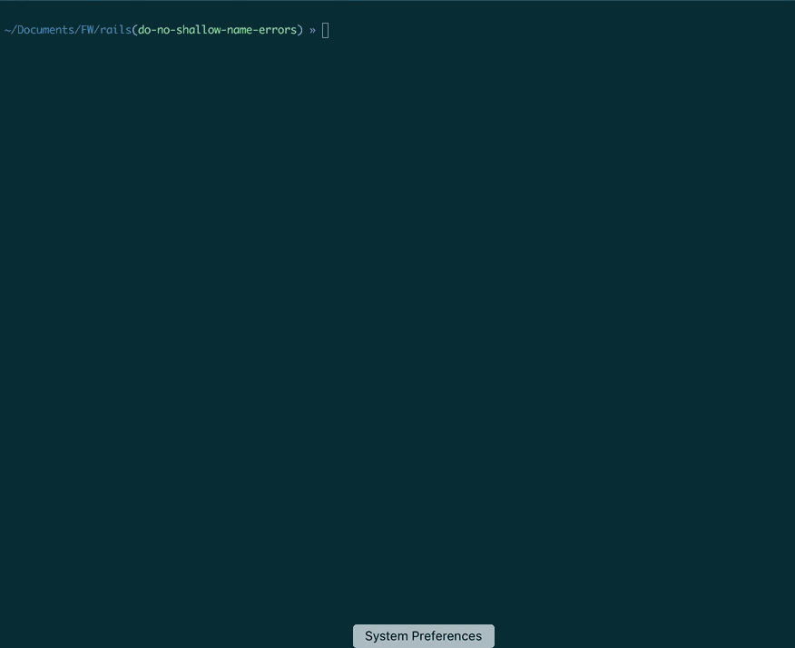

# nit

Git cmdline utils written in node.js

### Installation

`npm install -g @lazyloop/nit`

### usage

**help**

`nit -h` or `nit <command> -h`

**checkout branch:**

`nit checkout [-r<remote>]`

.

**delete branches:**

`nit delete [-m<multiple>]`

.

**stage files to commit:**

`nit add`

.

**discard local changes:**

`nit discard`

.
